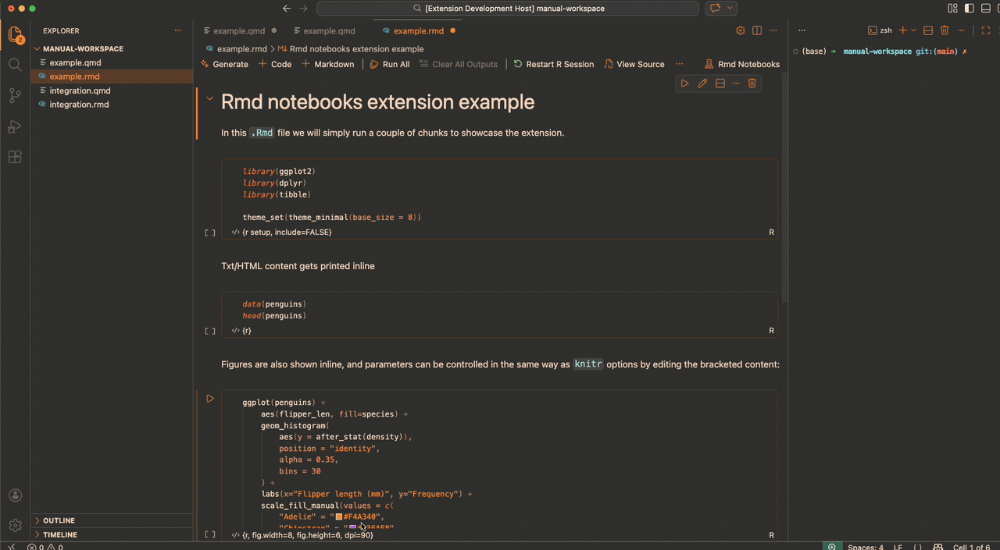

<p align="center">
  
</p>

# Rmd Notebooks for VS Code

<p align="center">
  
  
  <a href="https://marketplace.visualstudio.com/items?itemName=AlFontal.rmd-notebooks-vscode"></a>
  
  
</p>

Open `.Rmd` and `.qmd` files as runnable R notebooks in VS Code while keeping the source file on disk in fenced-source form.

For many R users, the default workflow has long been R Markdown in RStudio: write code in chunks, run them inline, and inspect plots and tables right where they were produced. Quarto (`.qmd`) keeps that same chunk-oriented workflow while broadening the document model.

In VS Code, that experience has usually been weaker. You can edit `.Rmd` and `.qmd` as text, and you can send code to an R terminal, but you do not normally get a proper inline notebook workflow with rendered outputs living next to the code.

This extension closes most of that gap. It opens `.Rmd` and `.qmd` files as runnable R notebooks in VS Code, keeps the underlying source on disk in fenced-source form, and lets you switch back to the raw file whenever you want.

## Demo



## Status

This project is working and publishable as a preview extension.

Current capabilities:

- opens `.Rmd` and `.qmd` as notebooks
- runs R code cells in a persistent per-document R session
- renders inline stdout, stderr, HTML, and static plots
- restores cached outputs on reopen
- marks outputs stale after code edits
- supports chunk-header editing from notebook mode
- lets you switch between notebook view and raw source view

Current limits:

- R only
- static image plots only
- no htmlwidgets
- only a small subset of knitr options is enforced today: `eval=FALSE`, `include=FALSE`, `results='hide'`
- interactive chunks fall back to an R terminal instead of inline stdin dialogs

## Commands

- `Rmd Notebooks: Run Current Chunk`
- `Rmd Notebooks: Run All Chunks`
- `Rmd Notebooks: Clear Current Output`
- `Rmd Notebooks: Clear All Outputs`
- `Rmd Notebooks: Restart R Session`
- `Rmd Notebooks: Run Current Chunk in R Terminal`
- `Rmd Notebooks: Show Output Panel`
- `Rmd Notebooks: Edit Chunk Header`
- `Rmd Notebooks: Toggle Notebook / Raw Source View`

The notebook toolbar also exposes `Restart R Session` and `View Source`.

If inline execution appears to stall because a chunk wants interactive input, the extension can prompt to run that chunk in an integrated R terminal instead. This is controlled by `rmdNotebooks.execution.interactiveFallbackBehavior` and `rmdNotebooks.execution.interactiveFallbackTimeoutMs`.

## Development

```bash
npm install
npm run compile
npm test
```

`npm test` is the full local verification path, including the real VS Code extension-host suite. GitHub Actions stays lighter and only runs the unit tests plus packaging checks.

Manual visual sessions:

```bash
npm run dev:visual
npm run dev:visual:rmd
npm run dev:example
npm run dev:example:rmd
```

## CI/CD

- GitHub Actions runs the lightweight repository checks on pushes and pull requests.
- GitHub Actions also handles the release path: it packages the extension as a `.vsix` and attaches it to GitHub releases.
- The full macOS extension-host test flow is kept as a local verification step via `npm test`.

## Example notebooks

- `test/manual-workspace/example.qmd`
- `test/manual-workspace/example.rmd`

## License

MIT
