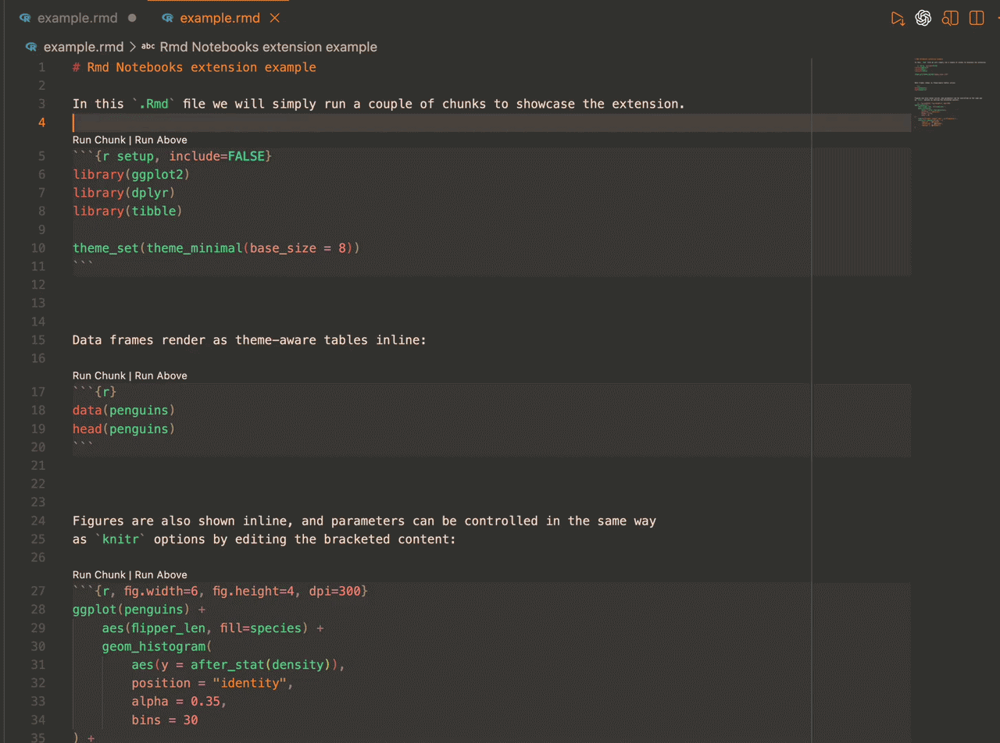

<p align="center">
  
</p>

# Rmd Notebooks for VS Code

<p align="center">
  
  <a href="https://marketplace.visualstudio.com/items?itemName=AlFontal.rmd-notebooks-vscode"></a>
  <a href="https://open-vsx.org/extension/AlFontal/rmd-notebooks-vscode"></a>
  
  
</p>

Run `.Rmd` and `.qmd` files as source-preserving notebooks in VS Code, with inline R execution, persisted outputs, plots, data-frame tables, and vscode-R workspace integration.

Rmd Notebooks opens R Markdown and Quarto documents as runnable notebooks without converting the file on disk. Code cells come from fenced chunks, outputs render inline, and the original source remains available whenever you want to inspect or edit it directly.

## Demo



## Install

- VS Code: install from the [VS Code Marketplace](https://marketplace.visualstudio.com/items?itemName=AlFontal.rmd-notebooks-vscode)
- Positron: install from [Open VSX](https://open-vsx.org/extension/AlFontal/rmd-notebooks-vscode)
- Manual: download the `.vsix` from the [GitHub releases page](https://github.com/AlFontal/rmd-notebooks-vscode/releases)

## Requirements

- VS Code `^1.88.0`
- R available on your PATH, or configured with `rmdNotebooks.r.path`
- The [vscode-R extension](https://marketplace.visualstudio.com/items?itemName=REditorSupport.r), installed automatically as an extension dependency

The vscode-R dependency is used for normal R tooling integration, including the R workspace viewer. Inline sessions can source vscode-R's session watcher so variables created in notebook chunks appear in the R sidebar.

## What It Does

- Opens `.Rmd`, `.rmd`, and `.qmd` files as notebooks
- Runs R chunks in a persistent per-document R session, queueing rapid requests in execution order
- Evaluates inline chunks in `.GlobalEnv`, so user variables are normal R workspace variables
- Honors normal R startup files by default, including project `.Rprofile` files used by tools such as `renv`
- Shows inline stdout, stderr, HTML snippets, static PNG plots, and theme-aware data-frame tables
- Shows execution-order badges per notebook and resets them when its R session restarts
- Persists outputs and restores them when the document is reopened
- Marks outputs stale after code edits
- Supports cancelling an individual running or queued cell, plus Stop All for the active notebook run
- Supports notebook commands for run current chunk, run all chunks, restart session, clear outputs, and source view
- Supports chunk-header editing from notebook mode
- Handles common prompt-style interactions such as `menu()` and `readline()` with VS Code UI
- Lets unsupported interactive chunks fall back to an R terminal when the optional timeout is enabled

## Workspace Viewer

Inline R sessions integrate with vscode-R's workspace watcher when `~/.vscode-R/init.R` is available. With the default settings, variables created from notebook chunks should appear under the R sidebar's Global Environment section.

You can verify the integration from a notebook cell:

```r
x <- 42
df <- data.frame(a = 1:3, b = letters[1:3])

cat("attached=", "tools:vscode" %in% search(), "\n")
cat("workspace=", file.exists(file.path(tempdir(), "vscode-R", "workspace.json")), "\n")
```

If you do not want inline sessions to source vscode-R's watcher, disable:

```json
{
  "rmdNotebooks.r.sourceVscodeRSessionWatcher": false
}
```

## Current Limits

- R is the only supported execution language
- Plots are captured as static PNG images
- htmlwidgets and full HTML dependency lifecycles are not supported yet
- Only a subset of knitr options is enforced today: `eval=FALSE`, `include=FALSE`, `results='hide'`, `fig.width`, `fig.height`, `fig.asp`, and `dpi`
- `echo`, `warning`, and `message` are parsed but not fully enforced
- Unsupported interactive flows can fall back to an R terminal only when `rmdNotebooks.execution.interactiveFallbackTimeoutMs` is enabled
- vscode-R workspace integration depends on vscode-R's current session watcher internals

## Commands

- `Rmd Notebooks: Run Current Chunk`
- `Rmd Notebooks: Run All Chunks`
- `Rmd Notebooks: Stop All Running Chunks`
- `Rmd Notebooks: Clear Current Output`
- `Rmd Notebooks: Clear All Outputs`
- `Rmd Notebooks: Restart R Session`
- `Rmd Notebooks: Run Current Chunk in R Terminal`
- `Rmd Notebooks: Show Output Panel`
- `Rmd Notebooks: Edit Chunk Header`
- `Rmd Notebooks: Toggle Notebook / Raw Source View`

The notebook toolbar also exposes `Stop All Running Chunks`, `Restart R Session`, and `View Source`.

## Settings

- `rmdNotebooks.r.path`: path to the R executable. Defaults to `R`.
- `rmdNotebooks.r.args`: arguments for inline chunk-execution R sessions. Defaults to `["--slave"]`.
- `rmdNotebooks.r.terminalArgs`: arguments for the interactive R terminal. Defaults to `["--vanilla"]`.
- `rmdNotebooks.r.sourceVscodeRSessionWatcher`: source `~/.vscode-R/init.R` in inline R sessions when present. Defaults to `true`.
- `rmdNotebooks.r.startupTimeoutMs`: time allowed for an inline R session to start. Defaults to `30000` milliseconds.
- `rmdNotebooks.execution.interactiveFallbackTimeoutMs`: timeout for treating a stalled inline chunk as unsupported interactive input. Defaults to `0`, which disables the timeout.
- `rmdNotebooks.execution.interactiveFallbackBehavior`: what to do when the optional interactive fallback timeout fires. Defaults to `prompt`.
- `rmdNotebooks.output.dataFrameRender`: render data frames as HTML tables instead of plain text. Defaults to `true`.
- `rmdNotebooks.output.dataFrameMaxRows`: row threshold before HTML tables collapse to their first and last rows. Defaults to `50`.
- `rmdNotebooks.output.dataFrameMaxColumns`: column threshold before HTML tables collapse to their first and last columns. Defaults to `50`.

Inline R sessions honor normal startup files by default. To isolate inline sessions from project startup files, add `--vanilla`:

```json
{
  "rmdNotebooks.r.args": ["--slave", "--vanilla"]
}
```

## Development

```bash
npm install
npm run compile
npm test
```

`npm test` is the full local verification path, including the real VS Code extension-host suite. GitHub Actions stays lighter and only runs the unit tests plus packaging checks.

For changes that affect R startup behavior, run the local `renv` smoke test:

```bash
npm run smoke:renv
```

This creates a temporary `renv` project and verifies that the default inline startup args activate the project while `--vanilla` keeps an inline session isolated. The command may install `renv` into a temporary bootstrap library if it is not already available.

For changes that affect vscode-R session watcher integration, run:

```bash
npm run smoke:vscode-r
```

This starts the inline R protocol with the vscode-R watcher enabled and verifies that variables created by a piped inline chunk appear in vscode-R's `workspace.json`.

To create a shareable test build from the current branch, run:

```bash
npm run package:vsix:test
```

This produces a `.vsix` file with the package version, branch name, and commit SHA in the filename.

On macOS, the VS Code extension-host portion of `npm test` may abort if it is launched from a restrictive sandbox. If that happens, rerun `npm run test:vscode` from a normal local shell/session outside the sandbox.

Manual visual sessions:

```bash
npm run dev:visual
npm run dev:visual:rmd
npm run dev:example
npm run dev:example:rmd
```

## CI/CD

- GitHub Actions runs the lightweight repository checks on pushes and pull requests.
- Pull request builds upload a branch-and-SHA-named `.vsix` artifact for manual testing.
- GitHub Actions also handles the release path: it checks that the release tag matches `package.json`, packages the extension as a `.vsix`, attaches it to GitHub releases, and publishes release tags to both the VS Code Marketplace and Open VSX.
- The full macOS extension-host test flow is kept as a local verification step via `npm test`.

## Example Notebooks

- `test/manual-workspace/example.qmd`
- `test/manual-workspace/example.rmd`

## License

MIT
