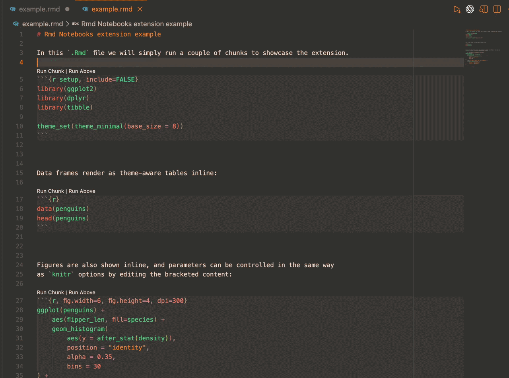

  

# Rmd Notebooks for VS Code

  
  
  
  
  

Run `.Rmd` and `.qmd` files as source-preserving notebooks in VS Code, with interactive R and Python execution, persisted outputs, plots, rich tables, and vscode-R workspace integration.

Rmd Notebooks turns fenced chunks into runnable notebook cells while keeping the original document unchanged on disk.

## Demo

## Install

- **VS Code:** [VS Code Marketplace](https://marketplace.visualstudio.com/items?itemName=AlFontal.rmd-notebooks-vscode)
- **Positron:** [Open VSX](https://open-vsx.org/extension/AlFontal/rmd-notebooks-vscode)
- **Manual:** download a `.vsix` from [GitHub Releases](https://github.com/AlFontal/rmd-notebooks-vscode/releases)

## Features

- Open `.Rmd` and `.qmd` files as native VS Code notebooks without converting the source.
- Run R and Python chunks in persistent per-document sessions with inline text, errors, plots, HTML, Markdown, and data frames.
- Select Python environments through VS Code tooling and integrate R sessions with vscode-R's workspace viewer.
- Persist outputs, preview rendered documents, edit chunk headers, and switch back to raw source at any time.

## Requirements

- VS Code-compatible editor API `^1.110.0`
- R on `PATH`, or configured with `rmdNotebooks.r.path`, for R chunks
- Python on `PATH`, or configured through the extension, plus IPython for Python chunks

The VS Code Marketplace build installs vscode-R integration automatically. The Open VSX build keeps vscode-R optional for compatibility with Positron and other VS Code-compatible editors.

## Documentation

- [Python environments](docs/python-environments.md)
- [R and vscode-R integration](docs/r-integration.md)
- [Commands, settings, and limitations](docs/reference.md)
- [Development and contributing](CONTRIBUTING.md)
- [Changelog](CHANGELOG.md)

Jupyter widgets and R htmlwidgets that require a full frontend dependency lifecycle are not currently supported. See the [reference](docs/reference.md#known-limitations) for details.

## License

MIT
